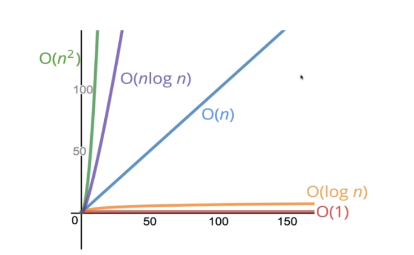

### NOTATION

## BIG O

# comptage
assignation ou affectation =>  '='

opération => '*,/,+,-,%'

comparaison => ' == , > , >= , < , <= , etc...'

boucle => 'for , while'

# Simplification du big-o
** une formule peut être simplifier par un caractère de complexité 
** le plus significatif de la formule
Ex : 13n + 5 => f(n) = n

f(n) linéaire f(n) = n
f(n) carré f(n) = n²
f(n) constant f(n) = 1
f(n) différent f(n) = ?

