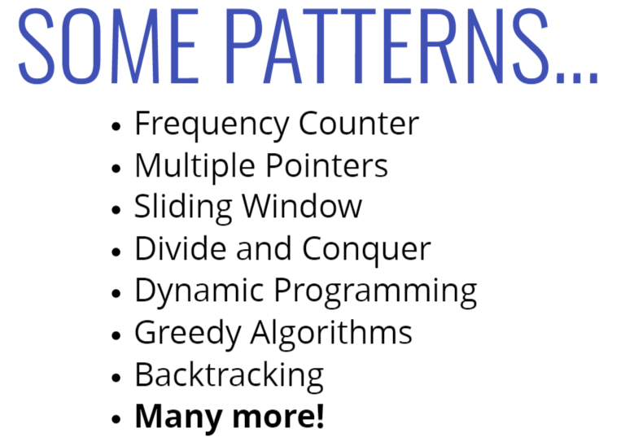

### NOTATION OBJECT METHOD

## BIG O

# comptage
Object.keys() => O(n)
Object.values() => O(n)
Object.entries() => O(n)
hasOwnProperty => O(1)
ajouter / supprimer un clé valeur => O(1)

# Different Patterns
